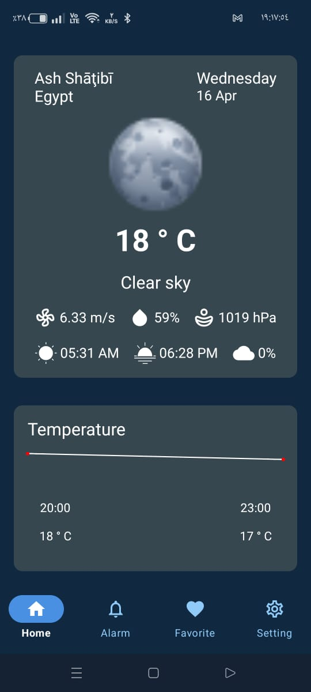
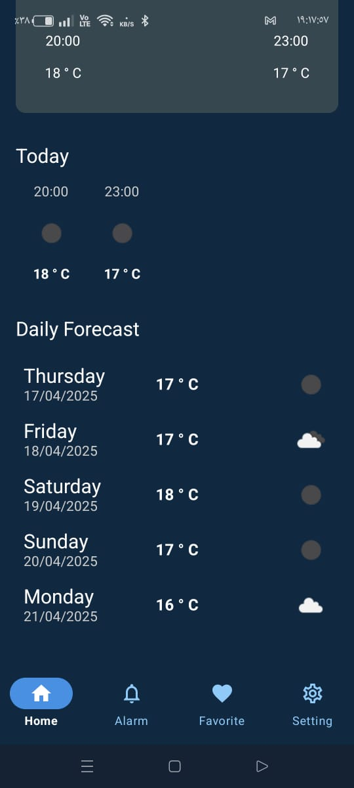
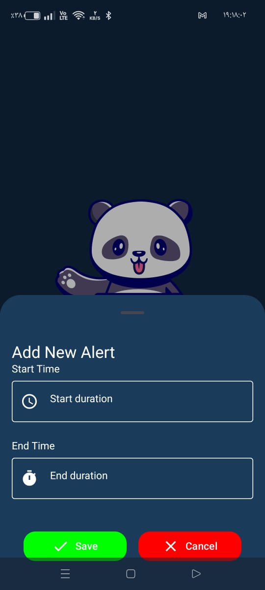
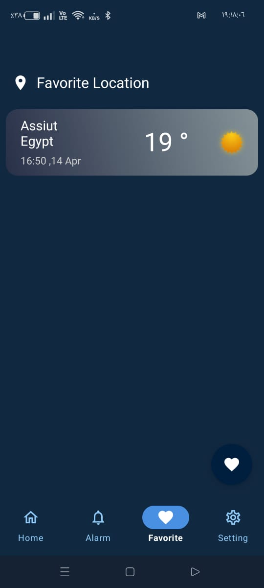

# Thundora

## Overview
**Thundora** is a modern weather app that provides users with up-to-date weather information and allows them to set custom weather-based alarms. It features a smooth Jetpack Compose UI, real-time weather updates, and a customizable alert system. The app is built using MVVM architecture with Kotlin and includes offline-friendly features and user personalization.

## Features
- **Real-time Weather:**
  - Displays current weather and forecasts.
  - Clean and intuitive UI built with Jetpack Compose.

- **Alarm Manager:**
  - Set multiple custom alarms for specific weather conditions.
  - Each alarm has a unique ID and checks for valid start/end times.

- **Navigation & Screens:**
  - Bottom navigation for quick access to **Home**, **Alarms**, **Favorites**, and **Settings**.
  - Splash screen with animated Lottie intro.

- **Favorites:**
  - Save favorite locations to quickly check their weather.

- **Settings:**
  - Customize app preferences.
  - Light/Dark mode support.

- **Architecture & Storage:**
  - MVVM architecture ensures clean separation of concerns.
  - Uses Room database to store alarms and favorites locally.
  - Data is persistently stored for offline access.

## App Flow
1. **Splash Screen:** Lottie animation intro.
2. Navigate via bottom navigation bar:
   - **Home Screen:** Shows current location's weather.
   - **Alarm Screen:** Create and manage custom alarms.
   - **Favorite Screen:** View and manage favorite locations.
   - **Settings Screen:** Personalize your app experience.

## Technologies Used
- **Language:** Kotlin
- **UI:** Jetpack Compose
- **Architecture:** MVVM (Model-View-ViewModel)
- **Database:** Room (for local alarms & favorites)
- **Alarm System:** Android AlarmManager
- **Animations:** Lottie for splash screen

## Screenshots

## Installation & Setup
1. Clone the repository.
2. Open the project in Android Studio.
3. Set up location and network permissions.
4. Run the app on an emulator or device with location services enabled.

## Contact
For any inquiries, connect with me on **LinkedIn**: [www.linkedin.com/in/ali-kotb-497a4718a](https://www.linkedin.com/in/ali-kotb-497a4718a)

## License
This project is open-source and available for personal and educational use.
